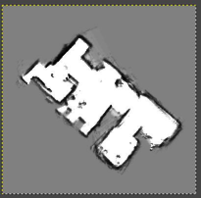

# Information about the package
#### Author: Julius Ortstadt

## Overview
Custom package to perform mapping operations with the Grabby robot. \
The **mapping.launch** file can be run in the terminal.\
The **map_visualization.launch** file needs to be run in the terminal on the Jetson desktop. This allows RVIZ to launch with custom settings.\
**Note:**\
Provided here are three configurations for Google cartographer:
- Only Lidar
- Lidar + IMU
- Lidar + IMU + Motor encoders

However, only the two first approaches have been implemented as the precision obtained was enough.


## Specifications
- **Development boards:** NVIDIA Jetson Nano / Arduino Mega
- **ROS Distribution:** ROS1 Melodic
- **Package Name:** cartographer_mapping
- **Build package and ws:** at root of ws run:
```
catkin_make
```
- **Source ws:** at root of ws run:
``` 
source devel/setup.bash
```
- **Launch files:**
  - *mapping.launch :* 
    - Load robot description (*grabby_robot.urdf*)
    - Start robot state publisher
    - Start RPLIDAR node (specify the serial port / default is set to *ttyUSB0*)
    -  Start Google Cartographer node with custom configuration file (uncomment the desired configuration in the *mapping.launch* launch file):
       -  Only LiDAR: *mapping_basic.lua*
       -  LiDAR + IMU: *mapping_imu.lua*
       -  LiDAR + IMU + Odometry: *mapping_imu_odom.lua*
  - *map_visualization.launch :*
    - Start Rviz with custom configuration (*demo.rviz*)   
- **Launch command:** (for default port configuration: /dev/ttyUSB0)
```
roslaunch cartographer_mapping mapping.launch
roslaunch cartographer_mapping map_visualization.launch
```
- **Launch command:** (for custom port configuration)
```
roslaunch cartographer_mapping mapping.launch serial_port:=/dev/ttyACM0
roslaunch cartographer_mapping map_visualization.launch
```
- **Saving the map:** (as a .pbstream). The result will be a *.pbstream* file.
```
rosservice call /write_state "filename: '/name/of/path/map_name.pbstream'"
```
Verify that the */write_state* service is launched:
```
rosservice list
```

- **Converting the map to a ROS map:** The result will be a *.yaml* file and a *.pgm* file.
```
rosrun cartographer_ros cartographer_pbstream_to_ros_map -pbstream_filename /name/of/path/map_name.pbstream -map_filestem /name/of/path/map_name_ros
```

The resolution of the resulting map can be specified as a parameter:
```
rosrun cartographer_ros cartographer_pbstream_to_ros_map -pbstream_filename /name/of/path/map_name.pbstream -map_filestem /name/of/path/map_name_ros --resolution 0.05
```

- **Visualizing the map in GIMP:** Resulting map seen in GIMP (load the *.pgm* file). 

- **FileZilla:** FileZilla was used to transfer files between the Jetson and the PC. Use *sftp://* for the configuration.

## Installation
To install Google cartographer, you can either use the prebuilt packages (done here) or build from source (described on the [Google cartographer documentation](https://google-cartographer-ros.readthedocs.io/en/latest/compilation.html)).

- Run this command:
```
sudo apt-get install ros-melodic-cartographer ros-melodic-cartographer-ros ros-melodic-cartographer-ros-msgs ros-melodic-cartographer-rviz
```


## Credit
A lot of inspiration for this part of the project was taken from the sources below:
- [Google Cartographer Documentation](https://google-cartographer.readthedocs.io/en/latest/index.html)
- [Google Cartographer ROS Integration](https://google-cartographer-ros.readthedocs.io/en/latest/index.html)
- [Google Cartographer Github](https://github.com/cartographer-project/cartographer_ros)
- [Google Cartographer Installation](https://ouster.com/insights/blog/building-maps-using-google-cartographer-and-the-os1-lidar-sensor)
- [Andrew-rw - Github](https://github.com/Andrew-rw/gbot_core/tree/main)
- [Andrew-rw - Medium](https://medium.com/robotics-weekends/2d-mapping-using-google-cartographer-and-rplidar-with-raspberry-pi-a94ce11e44c5)
- [ROS Wiki - URDF](http://wiki.ros.org/urdf/Tutorials/Create%20your%20own%20urdf%20file)
- [Rviz User Guide](http://wiki.ros.org/rviz/UserGuide)

The rest was done through experimenting and research. 