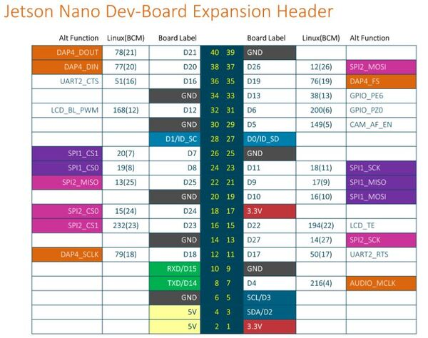

# Information about the package
#### Author: Julius Ortstadt

## Overview
ROS package that allows to read data from the MPU6050 board.
This board is connected via I2C with the NVIDIA Jetson Nano.
The package is written in Python.

The goal of this package is to provide *sensor_msg/Imu* data for Google Cartographer. 
The data can be visualized in Rviz by using the second provided launch file.

## Specifications
- **Development boards:** NVIDIA Jetson Nano
- **ROS Distribution:** ROS1 Melodic
- **Python:** The version that is compatible with ROS Melodic e.g. Python 2.7.x
- **Package Name:** mpu6050_custom_driver
- **ROS Dependencies:**
  - *sensor_msgs*
  - *geometry_msgs*
  - *tf*
- **ROS Topics:**
  - */imu* to publish the *sensor_msg*
- **Build package and ws:** at root of ws run:
```
catkin_make
```
- **Source ws:** at root of ws run:
``` 
source devel/setup.bash
```
- **Launch:** In two different terminals. The *visualization.launch* is only if the data should be shown in Rviz with a pre-made configuration (*demo_config.rviz*).
```
roslaunch mpu6050_custom_driver mpu6050.launch
roslaunch mpu6050_custom_driver mpu_visualization.launch
```
- **Required ROS dependencies:**
  - sensor_msgs
  - geometry_msgs
  - tf
  - tf2

## Wiring
Below is how to wire the MPU6050 ([Link](https://automaticaddison.com/visualize-imu-data-using-the-mpu6050-ros-and-jetson-nano/)):




- Connect VCC of the MPU6050 to pin 17 (3.3V) of the Jetson Nano.
- Connect GND of the MPU6050 to pin 25 (GND) of the Jetson Nano.
- Connect SCL of the MPU6050 to pin 5 (SCL) of the Jetson Nano.
- Connect SDA of the MPU6050 to pin 3 (SDA) of the Jetson Nano.

## Credit
The code is a collection of snippets that were found through research and on forums and websites. 
Below are the corresponding links:
- [Reading data from MPU6050](https://automaticaddison.com/visualize-imu-data-using-the-mpu6050-ros-and-jetson-nano/)
- [Creating a ROS Node for MPU6050](https://velog.io/@mseokq23/Jetson-Project6MPU6050-GY-521-6-Axis-IMU-SensorCustom-Script-Create)
- [Writing a Simple Publisher and Subscriber (Python)](http://wiki.ros.org/ROS/Tutorials/WritingPublisherSubscriber%28python%29)
- [MPU6050 Datasheet](https://invensense.tdk.com/wp-content/uploads/2015/02/MPU-6000-Datasheet1.pdf)
- [MPU6050 Register Map](https://invensense.tdk.com/wp-content/uploads/2015/02/MPU-6000-Register-Map1.pdf)
- [sensor_msgs/Imu Message](http://docs.ros.org/en/noetic/api/sensor_msgs/html/msg/Imu.html)
- [tf broadcaster](https://github.com/bandasaikrishna/orientations_from_IMU_MPU_6050/blob/main/mpu_6050_driver/scripts/tf_broadcaster_imu.py)