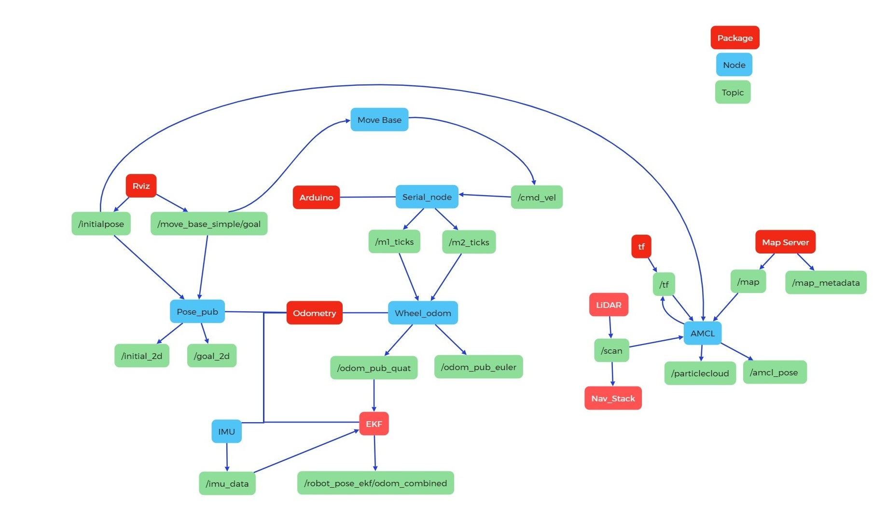

# Setup of the Navigation workspace for the Grabby project

---

**Project:** Grabby\
**Author:** Julius Ortstadt\
**Date:** 17.01.2026\
**Description:** Information about the setup and configuration of the navigation workspace for the Grabby robot.

---

## Table of Contents
- [Setup of the Navigation workspace for the Grabby project](#setup-of-the-navigation-workspace-for-the-grabby-project)
  - [Table of Contents](#table-of-contents)
  - [Information](#information)
  - [Specifications](#specifications)
  - [Setup](#setup)
    - [Workspace](#workspace)
    - [LiDAR package](#lidar-package)
      - [Testing in the terminal](#testing-in-the-terminal)
      - [Testing with RVIZ](#testing-with-rviz)
    - [IMU package](#imu-package)
      - [Installation](#installation)
      - [Testing](#testing)
    - [Localization data publisher package](#localization-data-publisher-package)
      - [Information](#information-1)
      - [Setup](#setup-1)
    - [Robot pose ekf package](#robot-pose-ekf-package)
      - [Installation](#installation-1)
    - [Navigation package](#navigation-package)
      - [Information](#information-2)
      - [Installation and Setup](#installation-and-setup)
  - [Troubleshooting](#troubleshooting)
    - [Frame misalignment](#frame-misalignment)
  - [References](#references)


## Information
The launch commands can be found in the **Info** file of this directory.
This file describes the configuration and setup of the various packages in the workspace to achieve navigation capabilities with the robot.

## Specifications
**Development boards:** RaspberryPi 5 / Arduino Nano\
**ROS Distribution:** ROS1 Melodic in Docker container\


## Setup
### Workspace
- Create a folder
```bash
mkdir -p ./navigation_ws/src
cd navigation_ws
```
- Build the workspace
```bash
catkin_make
```
- Source the workspace
```bash
source devel/setup.bash
```
- Auto-source the workspace at container startup by adding the following to the **.bashrc**
```bash
nano ~/.bashrc
source /ros_shared/navigation_ws/devel/setup.bash
```

### LiDAR package
Install the RPLiDAR ROS package to use the LiDAR for mapping.
- Go to the **src** folder of the workspace
- Clone the repository
```bash
sudo git clone https://github.com/Slamtec/rplidar_ros.git
```
- Go back to the root of the workspace and build the workspace
```bash
catkin_make
```

#### Testing in the terminal 
- Start *roscore* in one terminal
- In another terminal, launch the LiDAR node. The default port is /dev/ttyUSB0. If another port has been assigned, use the argument: 
```bash
roslaunch rplidar_ros rplidar_a1.launch
```
- In a new terminal, the **/scan** topic should now be displayed when typing:
```bash
rostopic list
```
- The raw data can be displayed with:
```bash
rostopic echo /scan
```

#### Testing with RVIZ
To visualize the data in RVIZ, do the previous steps as for the terminal but instead of the *echo* command:
- Start rviz by typing *rviz* in the terminal
- Go to *Add* -> *By topic* -> *LaserScan*
- Under the topic, select */scan*
- Change the *fixed frame* from *map* to *laser*


### IMU package
#### Installation
- Connect the IMU following the [pinout](https://pinout.xyz/) of the Pi.

  | BNO055 Pin | Pi Pin Number            |
  |------------|--------------------------|
  | Vin        | 3.3V Power               |
  | GND        | Ground (GND)             |
  | SDA        | I2C SDA                  |
  | SCL        | I2C SCL                  |

- After booting the RPi5, test if the IMU is detected. The command should show the adress of the IMU.
```bash
sudo i2cdetect -r -y 1
```
- Install the libi2c-dev library
```bash
sudo apt-get install libi2c-dev
```
- In the **src** folder of the workspace, clone the package
```bash
git clone https://github.com/dheera/ros-imu-bno055.git
```
- Go back to the root of the workspace and build
```bash
catkin_make
```

#### Testing
- Install the ROS IMU plugin so that the IMU can be visualized in rviz
```bash
sudo apt-get install ros-melodic-rviz-imu-plugin
```
- In a new docker terminal
```bash
roslaunch imu_bno055 imu.launch
```
- Check if the **/imu/data** topic is there
```bash
rostopic list
```
- Start RVIZ
```bash
rviz
```
- Change the fixed frame to imu.
- Click the Add button in the bottom left.
- Click imu under rviz_imu_plugin. 
- Click OK.
- Change the topic of the imu to /imu/data.
- Move the BNO055 around, and the axes should move. 
  - The red line is the x-axis
  - The green line is the y-axis
  - The blue line is the z-axis.

### Localization data publisher package
#### Information
- **Package Name:** localization_data_pub
- **Publishes:**
  - */initial_2d* (geometry_msgs/PoseStamped)
  - */goal_2d topic* (geometry_msgs/PoseStamped)
- **Subscribes:**
  - */initialpose* (geometry_msgs/PoseWithCovarianceStamped)
  - */move_base_simple/goal* (geometry_msgs/PoseStamped)

#### Setup
- In the workspace **src** folder
```bash
catkin_create_pkg localization_data_pub rospy roscpp std_msgs tf tf2_ros geometry_msgs sensor_msgs nav_msgs
```
- Go back to the workspace root and build
```bash
catkin_make
```
- In the source of this package, add the files **ekf_odom_pub.cpp** and **rviz_click_to_2d.cpp**
- Modify the *CMakeLists.txt* (the completed file is provided here).
- The launch file is optional as it will be handled by the navigation stack which holds the mail launch file.

### Robot pose ekf package
#### Installation
- Run the command
```bash
sudo apt-get install ros-melodic-robot-pose-ekf
```


### Navigation package
#### Information
- **Package Name:** nav_stack


* `Base controller`
The base controller is implemented in the script **motor_controller_diff_drive_2.ino**, which must be uploaded to the Arduino before launching the package. The controller receives velocity commands from the `move_base` node and converts them into PWM signals to drive the motors. It also publishes motor encoder ticks for odometry computation. Additionally, the controller includes speed correction mechanisms to compensate for motor mismatches and ensure straight-line motion.


* `Costmap configuration "param"`
  * `base_local_planner_params.yaml`
These parameters define the motion constraints and behavior of the robot’s local planner. They specify limits for linear and angular velocities, acceleration bounds, and goal tolerances. The robot is configured as a non-holonomic system, meaning lateral motion is not permitted. The `meter_scoring` parameter ensures that path costs are evaluated in meters.

  * `costmap_common_params.yaml`
These settings apply to both the global and local costmaps, defining the robot’s footprint, sensor range for obstacle detection, and costmap update frequencies. The footprint is explicitly defined with padding for safety. 
Three primary layers are used:

    - **Static Layer:** Uses a pre-defined map.  
    - **Obstacle Layer:** Updates obstacles dynamically from sensor data.  
    - **Inflation Layer:** Expands obstacle areas to maintain safe distances and prevent collisions.

  * `global_costmap_params.yaml`
  The global costmap represents the entire environment relative to the `odom` frame. It updates at the specified frequency with the specified resolution and is primarily used for long-term path planning.

  * `local_costmap_params.yaml`
The local costmap is a smaller, rolling window centered on the robot, used for short-term obstacle avoidance. It updates at the specified frequency, with the specified inflation radius. Sensor data is integrated dynamically, and the costmap maintains a 1×1 meter window for efficient navigation.

* `Launch file "nav.launch"`
All information about the launch file is documented in the file comments. A brief overview is provided below.

  * `State publisher`
Loads the robot description from the URDF file.

  * `LiDAR Launch`
Starts the LiDAR node using either the default serial port (**/dev/ttyUSB1**) or a user-specified port. The node relies on the ROS package provided by RPLIDAR.

  * `Odometry Launch`
Starts the wheel odometry node, which converts wheel encoder ticks into odometry data. The IMU data publisher is also launched, and an Extended Kalman Filter (EKF) fuses the wheel and IMU data for reliable SLAM input.

  * `Wheel Encoder Tick Publisher and Base Controller`
Starts serial communication with the Arduino running the base controller script. The serial port can be set via an argument or defaults to **/dev/ttyUSB0**.

  * `Mapping Information`
Launches the initial pose and goal publisher for setting start and end positions in RViz. RViz is also launched for visualization. The map file and map server are loaded to allow the robot to use a pre-existing map.

  * `Move Base Node`
Converts SLAM output into velocity commands for the Arduino, which publishes them to a topic for execution by the base controller.

  * `AMCL Configuration`
Provides an example configuration of AMCL (Adaptive Monte Carlo Localization) for differential drive robots. AMCL is a probabilistic 2D localization system for mobile robots.


#### Installation and Setup
- Install the navigation stack
```bash
sudo apt-get install ros-melodic-navigation
```
- In the **src** folder of the workspace, create a package
```bash
catkin_create_pkg navstack_pub rospy roscpp std_msgs tf tf2_ros geometry_msgs sensor_msgs nav_msgs move_base
```
- Go to the root of this new package
  - Create a **param** folder
  - Create a **launch** folder
  - Create a **rviz** folder
  - Create a **urdf** folder
- Copy the files from this repo to their respective folders
- Modify the **CMakeLists.txt** and the **package.xml** files with the ones in this repository
- Go back to the root of the workspace and build the workspace
```bash
catkin_make
```

## Troubleshooting 
### Frame misalignment
If there are problems with the frames and the tf transforms, check the tf tree.
- While the package is running and the **initial_pose** and **goal_pose** have been set, run:
```bash
rosrun tf view_frames
```
- When the command is finished:
```
evince frames.pdf
```
**Note:** If *evince* is not installed, run `sudo apt install evince`.

The resulting frame should look like this:
[TF tree]()

## References
- ROS1 Melodic: Create a workspace
https://wiki.ros.org/catkin/Tutorials/create_a_workspace

- ROS1 Melodic: Create a package
https://wiki.ros.org/ROS/Tutorials/CreatingPackage

- RPLIDAR GitHub repository
https://github.com/Slamtec/rplidar_ros

- How to Publish IMU Data Using ROS and the BNO055 IMU Sensor
https://automaticaddison.com/how-to-publish-imu-data-using-ros-and-the-bno055-imu-sensor/

- ROS Standard Units of Measure and Coordinate Conventions
https://www.ros.org/reps/rep-0103.html

- How to Set Up the ROS Navigation Stack on a Robot
https://automaticaddison.com/how-to-set-up-the-ros-navigation-stack-on-a-robot/

- How to Create an Initial Pose and Goal Publisher in ROS
https://automaticaddison.com/how-to-create-an-initial-pose-and-goal-publisher-in-ros/

- RaspberryPi Pinout
https://pinout.xyz/

- robot_pose_ekf
https://wiki.ros.org/robot_pose_ekf

- Adafruit 9-DOF Absolute Orientation IMU Fusion Breakout - BNO055
https://www.adafruit.com/product/2472

- ROS1/ROS2 C++ driver for Bosch BNO055 IMU (I2C)
https://github.com/dheera/ros-imu-bno055