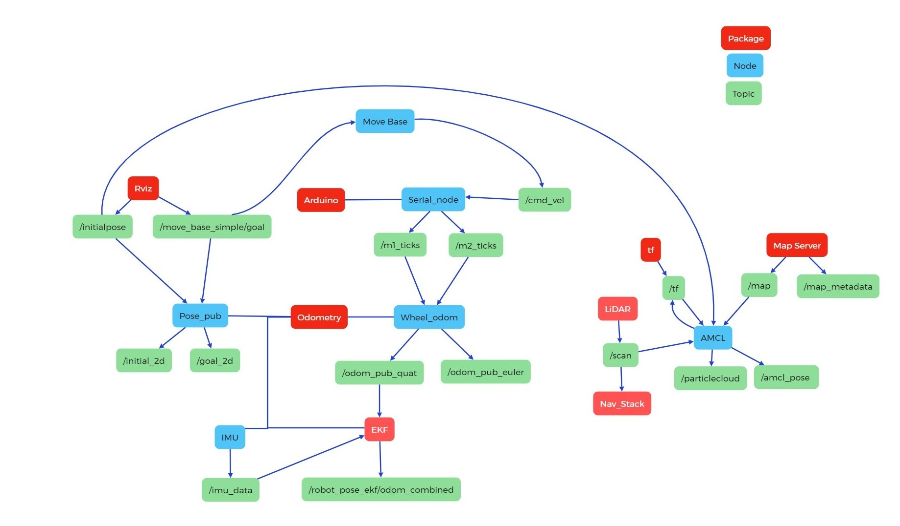

# Information about the package
#### Author: Julius Ortstadt

## Overview
ROS package that performs the autonomous navigation of the Grabby robot by utilizing the data provided by the other packages in the workspace.

## Specifications
- **Development boards:** NVIDIA Jetson Nano & Arduino Mega 2560
- **ROS Distribution:** ROS1 Melodic
- **Package Name:** nav_stack
- **Build package and ws:** at root of ws run:
```
catkin_make
```
- **Source ws:** at root of ws run:
``` 
source devel/setup.bash
```
- **Launch:** (with default config)
For the standard configuration use this command to launch the robot. This sets the serial port for the LiDAR to **ttyUSB1** and for the Arduino to **ttyUSB0**.
```
roslaunch nav_stack nav.launch
```
- **Launch:** (with custom config) 
There are 3 things that can be customized (use either all of them or just the ones needed). Below is an example command with all three.
  - The serial port of the Arduino: *serial_port_arduino*
  - The serial port of the LiDAR: *serial_port_lidar*
  - The location of the map file (it needs to point to the *.yaml* file of the ros map and not the *.pgm* as it is already referenced in the *.yaml*): *map_file*
```
roslaunch nav_stack nav.launch serial_port_lidar:=/dev/ttyUSB0 serial_port_arduino:=/dev/ttyUSB1 map_file:="path/to/the/map/file/map_file.yaml"
```


## Architecture 
Below is a diagramm showing how all the different components work together to correctly configure the ROS Nav_stack.



## Base controller
The base controller corresponds to the script named **motor_controller_diff_drive_2.ino** which has to be loaded onto the Arduino before starting the package. 
It allows the Arduino to use the velocity commands sent to it by the move base node and convert them into PWM signals which are then written to the motors to drive the robot.
Additionnaly, the code also publishes the ticks of each motor for the odometry information. 
This controller also includes different correction mechanism for speed difference between the motor and it makes sure that the robot goes straight.

## Costmap configuration
### Base Local Planner Params
These parameters define the movement constraints and behavior of the robot's local planner. 
It sets the velocity limits for linear and rotational motion, acceleration limits, and goal tolerances. 
The robot is configured as a non-holonomic system, meaning it cannot move sideways. 
The meter_scoring parameter ensures path costs are evaluated in meters.

### Costmap Common Params
These settings apply to both the global and local costmaps. 
They define the robot's footprint, sensor range for obstacle detection, and costmap update frequencies. 
The robot's footprint is explicitly defined with padding for safety. Three primary layers are used:

- Static Layer: Uses a pre-defined map.
- Obstacle Layer: Updates obstacles dynamically from sensor data.
- Inflation Layer: Expands obstacle areas for collision avoidance.


### Global Costmap Params
The global costmap represents the entire environment relative to the odom frame. 
It updates at 30 Hz and has a resolution of 0.1 meters. 
This costmap is primarily used for long-term path planning.

### Local Costmap Params
The local costmap is a smaller, rolling window around the robot, used for short-term obstacle avoidance. 
It also updates at 30 Hz, with an inflation radius of 0.1 meters. 
The local costmap dynamically integrates sensor data and maintains a 1x1 meter window for efficient navigation.

## Launch file
All the information about the launch file can be found in the file itself in the comments. 
Nonetheless, here is a quick overview.

### Transformation Configuration
Describes the transforms between the different frames of the robot.
The values depend on the robot and where the different components and frames are located relative to the robot (mainly the center).

### LiDAR Launch
Launches the LiDAR node by either using the default serial port configuration or the one provided by the user when launching the package. 
The default config is **/dev/ttyUSB1**. 
It uses the ROS package provided by RPLIDAR.

### Odometry Launch
Starts the wheel odometry node which takes the tick data from the wheels and converts them into usable odometry data.
It also launches the IMU Data publisher which publishes the IMU data to the correct topic.
The EKF (Extended Kalman Filter) is used to fuse this data together and have reliable data for the SLAM algorithm.

### Wheel Encoder Tick Publisher and Base Controller Using Arduino
This starts the serial communication with the Arduino where the base controller script is already loaded. 
The serial port configuration can be specified by launch as an argument in the roslaunch command or the default configuration can be used which is **/dev/ttyUSB0**. 

### Mapping Information
This launches the initial pose and goal publisher which relays to the code where the user set the start and end positions in RVIZ.
It also launches RVIZ to visualize everything.
Furthermore, the map file and server are loaded so that the robot can use the already provided map.

### Move Base Node
The move base node basically converts the SLAM algorithm's commands into usable velocity commands for the Arduino which it will then publish to a topic for the Arduino to read and execute.

### AMCL Configuration
Adds an AMCL example for differential drive robots.
AMCL is a probabilistic 2D moving robot location system. 

## Credit
To configure the navigation stack, I based my approach on the sources below:
- [Main tutorial](https://automaticaddison.com/how-to-set-up-the-ros-navigation-stack-on-a-robot/)
