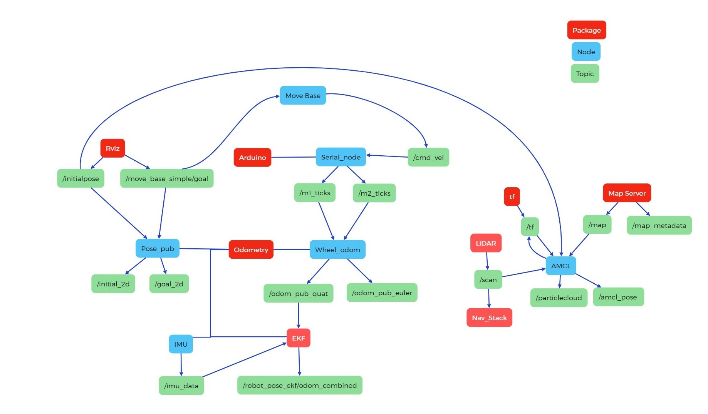
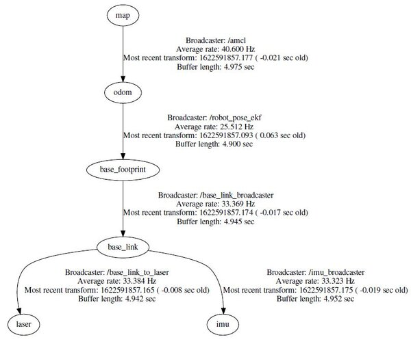

# Information about the mapping process
#### Author: Julius Ortstadt

## General Information
In the code section "Navigation", the entire code for the setup of the ROS1 Navstack has been provided.\
Note however that the turn direction between real-life and the interpreted data in RVIZ is mirrored. This effect is due to the 6-DoF IMU that is used.\
To solve this issue, a 9-DoF IMU sensor needs to be implemented so that AMCL can correctly estimate the yaw angle rotation and correct for any potential misalignment.

The previously explained issue will cause the robot to turn in the opposite direction than it should meaning that the navigation will fail unless this issue is corrected.\

**We will update this section once the issue has been solved.**

## Navigation Architecture
Below is a quick overview showing how the navstack setup looks like in ROS and how the TF tree should look. 
Concerning the TF, note that some transforms (provided by EKF and AMCL) will be only be published once the initial goal and pose have been set and the code sends the first commands.

--- [Source](https://automaticaddison.com/how-to-set-up-the-ros-navigation-stack-on-a-robot/) ---